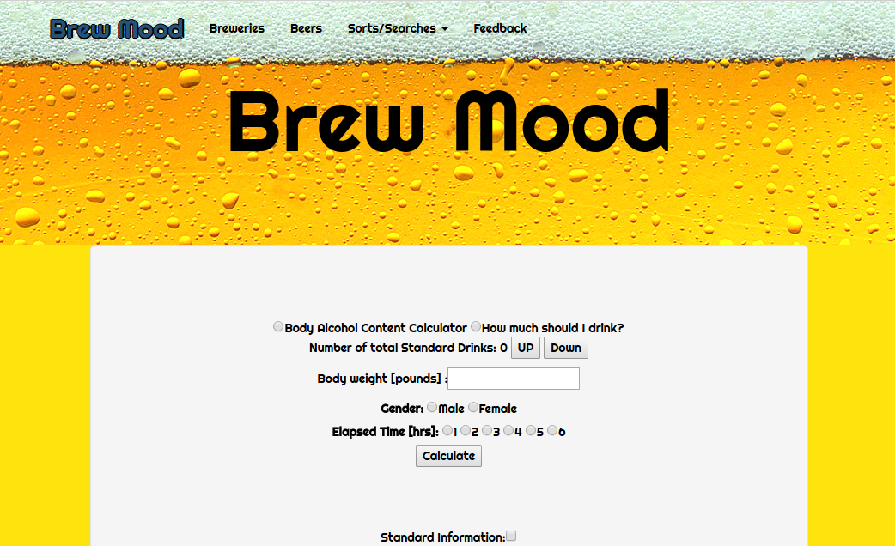
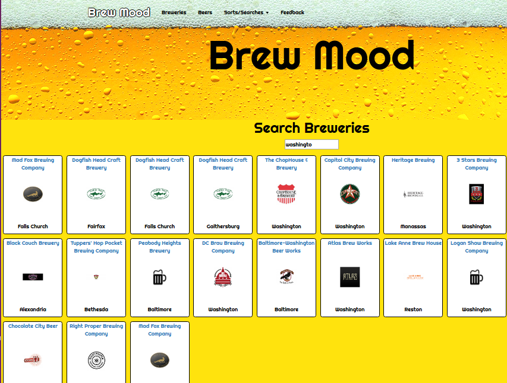

README

##Brew Mood

##About This app is project 3 (group project) for WDI16 - GA's Web Development Immersive course. Brew Mood is a brewery and beer web app that aims to help you find the right beer for you, based on a variety of attributes. This app is specific to DC, MD, and VA.

##Project Requirements -This app must contain a backend API with at least 2 models – no associations are required -This app must use an angular front end that leverages the backend API in the above requirement

Contribution Guidelines -Each member of your group must have an individual commit history to your project's repositories -Each project should include a readme.md that provides information as to the roles of each member of the group. It should include the responsibilities of each member and their accomplishments. -Each member of your group is expected to present for an equal amount of time during project presentations -During 10-minute daily scrums with an assigned instructor, teams members must share progress. Scrum discussion topics may include goal-setting, time management, accomplishments and individual group contributions. This is not time to address technical issues.

##Technologies

Front end HTML5, CSS3, AngularJS, Bootstrap, Jquery

Back end Ruby on Rails, ActiveRecord

Database creation The database information is from BreweryDB.com's API. They have a premium API subscription service, though we cloned it and hosted a local copy for this project. The data is relevant as of June 2017.

##Launching this app

Clone repo to local
Run bundle install from terminal
In terminal: drop, create, migrate, and seed Database if using local clone. Visit http://www.brewerydb.com/developers to get your own API key to use BreweryDB's most current API.
##Future Iterations This app was completed in 5 days and there are many additional features that we'd add to make this 100% functional and more user friendly.

Add a comments model so people can leave feedback and comments on breweries.
Add user authentication, which opens a whole realm of possibilities like user favorites, brewery checkin, more secure posting parameters.
Rating system for beers.
Map to populate breweries nearby based on location services API.
Expand the database to include breweries from across the US and then international.

## Deployment
The app is deployed using AWS and can be found: http://brewmood.com.s3-website-us-east-1.amazonaws.com/

## Screen shot of the app:

